:beginner:\
Assignment 1: Front-End Scripting\
Name: Christopher Paul Caston\
Student id: j354374


- [Stage 1: Laying the foundations](#stage-1-)
- [Stage 2: Adding javascript functions](#stage-2--adding-javascript-functions)
- [Stage 3: Checking input](#stage-3--checking-input)
- [Stage 4: Doing the math](#stage-4--doing-the-math)
- [References](#references)


## Stage 1: Laying the foundations
&#x1F535;

First the javascript application is built by creating the html document backbone and we introduce functionality in different stages.
In stage 1 this is just html with the use of the table function [[1]](#1) with the &lt;tr&gt; (table row) and &lt;td&gt; (table data) tags.
We have one text input box [[2]](#2) but no button as yet.

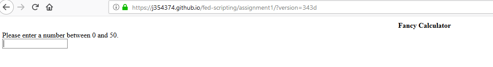

In the next part code is entered to create the HTML button. This is using the &lt;button&gt; tag. [[3]](#3) 


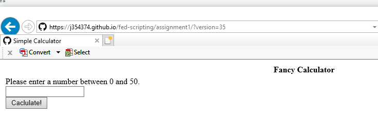

Currently we can enter text and press the button but no input detection or calculation takes place.
 

We have now added the disabled inputs [[4]](#4) that will (eventually) show the number in factorial, squared and cubed.

Please see the following screenshot:

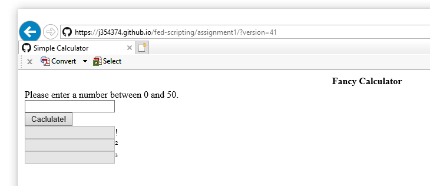

Here is the code (from index.html) so far:

```
<!doctype html>
<html lang="en">
<head>
<meta charset="utf-8">
<title>Simple Calculator</title>
</head>
<body>
<header>
</header>
<nav></nav>
<main>

 <table style="width:100%">
  
 <tr>  <th>Fancy Calculator</hd></tr>
 <td>
 <form>
 <label for="number">Please enter a number between 0 and 50.</label><br>
 <input type="text" id="number" name="number"><br>
 <button type="button">Caclulate!</button> <br>
 <input type="text" id="factorial" name="factorial" disabled>!<br>
 <input type="text" id="squared" name="squared" disabled>&sup2;<br>
 <input type="text" id="cubed" name="cubed" disabled>&#xB3;<br>    
 </form> 
 </td>
 </tr>
  
</table> 
  
  
</main>
<footer>
<!--- Script 2.1 - template.html -->
<!--- script src="js/calc.js"> 
</footer>
</body>
</html>

```
Please note the escape characters included for factorial, squared and cubed are from HTML 4 Entities. [[5]](#5) 

## Stage 2: Adding javascript functions
&#x1F535;


First we change the code in index.html to add onclick (onclick Event) [[6]](#6) = function() [[7]](#7) as follows:


```
<button type="button" onclick="echo(number.value)">Calculate!</button><br>
```

and enabled the script src using the following tag &lt;script&gt; [[8]](#8).

```
<script src="js/calc.js"> 
```

and we create a file called calc.js with the following:

```
//calc.js

function functionName( echo ){
	alert('You entered, ' + number + '!');
}
```


Unfortunately this doesn't show the alert we are expecting. To debug this I have opened the debug console in the chrome browser and found the following under the console table.

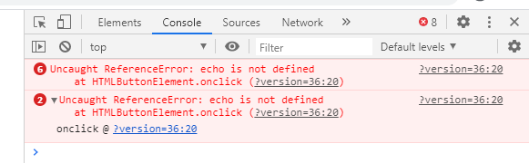


First I noticed some errors in my js code. I have changed the function code to:

```
function echo( number ) {
	alert("You entered", + number + "!");
```

and I have added a debug line:

```
console.log("Hello");
```

Unfortunately it still can't find the "echo" function and it also isn't showing the console log message.

I have changed the script src as follows:

```
<script src="/js/calc.js"> 
```

Unfortunately this still didn't work. However from the console log under the HTML inspector I noticed the following:

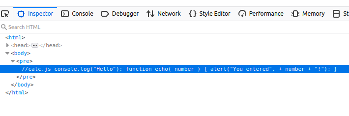

It appears that all the code is commented out!

My text editor (github Ed file) must not be adding a new line code.

I have changed the type of comment and my file now looks like this:

```
`/* calc.js */

console.log("Hello");

function echo( number ) {
	alert("You entered", + number + "!");
}


```

After reloading the page I find yet another error:

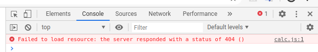

I have changed the script src in index.html back to

```
<!--- Script 2.1 - template.html -->
<script src="js/calc.js"> 
```

Unfortunately we are still getting the original error about the echo function.

I have changed the index.html code as follows to remove the ';' sign:

```
 <button type="button" onclick="javascript:echo(number.value)">Calculate!</button><br>
 ```


I also found that their was no terminating html tag for script. We now have the following in index.html:

```
<script src="js/calc.js"></script>
```

Now we are getting the alert! 
-
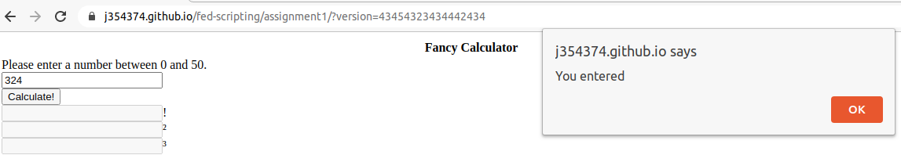

It still wasn't quite right as per the screenshot above so I have adjusted the alert code as follows:

```
function echo(number) {
    alert("You entered: " + number + "!");
}
```

Now we are getting there:

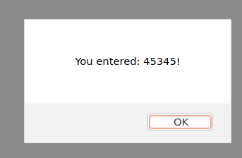


## Stage 3: Checking input
&#x1F535;

We still need to do the following to check the input. We need to make sure it is a number, we need to make sure it is a integer (that is a whole number) and we need
to make sure it is between and 0 and 50.

First we add the following code:

```
if(Number.isNaN(number)) num = 1; 
    alert("That's not a number!"); 
```    

However we find that it gives us the alert no matter if we type a number or a letter!
This is frustrating but there is an explanation.  


> Number.isNaN() both test if a value is (or, in the case of isNaN(), can be converted to a number-type value that represents) the NaN value. In other words, "NaN" does not simply mean "this value is not a number", it specifically means "this value is a numeric Not-a-Number value according to IEEE-754".

So lets try something else:

```
if (typeof number === 'number')
   alert("That's not a number!"); 
```

At this point things are getting very confusing. So we check the best practice for naming rules and variables.

>Try to make your variable names look as different from JavaScript's keywords and other built-in terms (such as alert) as possible. This helps avoid the confusion that can arise when you look at a term and you can't remember if it's a variable or a JavaScript wor. Use Multiple-Word Names - This helps a bit because most JavaScript terms are single words.


Let's rename our variable "number" to "fancynumber".

The code in index.html was changed to:

```
 <label for="fancynumber">Please enter a number between 0 and 50.</label><br>
 <input type="text" id="fancynumber" name="fancynumber"><br>
 <button type="button" onclick="echo(fancynumber.value)">Calculate!</button><br>
 ```
 
 The function in calc.js was changed to the following:
 
 ```
 function echo(fancynumber) {
    alert("You entered: " + fancynumber + "!");
 ```   
 and Number.isNaN was removed.
 
We next add this if statement to: 

```
if (typeof fancynumber !== 'number')
   alert("That's not a number!");
```
!== is a javascript operator that checks for:
>not equal value or not equal type [[999]](#999).

Before going any further lets validate our HTML using the [W3C mark-up validation service](https://validator.w3.org/).
We can see two errors as follows:
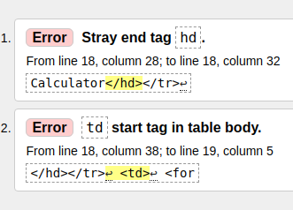

In order to connect the validation errors lines 18 and 19 have been changed as follows:

```
<tr><th>Fancy Calculator</th></tr>
<tr><td>
```

From the validator we now get:

```
Document checking completed. No errors or warnings to show.
```


Unforuntately it appears the typeof code isn't working for us either but we can actually check the validation in HTML. We change line 22 of index.html as follows:

```
<input type="number" id="fancynumber" name="fancynumber" min="1" max="50"><br>

```
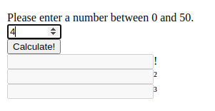

This creates up and down arrows and prevents typing letters or special characters in but still allows numbers out of range such as negative numbers or numbers above 50 to be typed. It allows 'e', '.' and '-' as those characters are often used in math. There may be other characters too but this means that javascript needs to be used for further input validation.

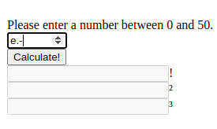

Additionally the Midori browser lets the user type anything they want.

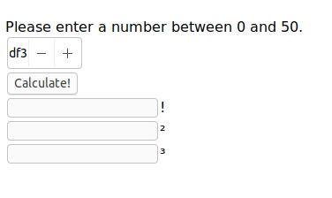

typeof has been commented out and an if statement has been entered that uses Number.isInteger:


```
/* calc.js */

console.log("Hello");

function echo(fancynumber) {
    alert("You entered: " + fancynumber + "!");
 
 if (Number.isInteger(+fancynumber)) {
    alert("That's an integer!");
} else {
    alert("That's not a integer!");
}   
       
    
  /*  if (typeof fancynumber !== 'number')
   alert("That's not a number!");*/

    
}
```
Another code segment has been found to work properly. This is from the example provided by w3 schools.

```
// If x is Not a Number or less than one or greater than 50
  if (isNaN(fancynumber) || fancynumber < 1 || fancynumber > 50) {
    alert("Input is not valid!");
  } else {
     /*alert("Input is OK!"); */
      document.getElementById("factorial").disabled = false;
    /*  document.getElementById("factorial").value = "1"; */
        
  }    
  
  ```

This changes the input text box to enabled provided a valid input is entered as shown in the following screenshot:

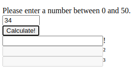

## Stage 4: Doing the math
&#x1F535;

```
console.log(factorial(fancynumber));

```


```
fancyfactorial = factorial(fancynumber);
```

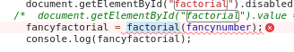

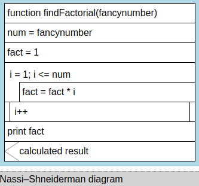


:loop:

```
* testing code */
      function findFactorial(fancynumber){
		
	        console.log("function findFactorial has started");
		var num = fancynumber;
		var fact = 1;
		
		//loop till the iterator i equals to number
		for (i = 1; i <= num; i++){
                         
			//formula to calculate factorial is to 
			//multiply the iterator i value with fact value.			
			fact = fact * i;
                         console.log(i);
			 console.log(fact);
		
			//put the below lines of code out of this 'for loop' to show only the total value
            
			document.getElementById("factorial").value(fact);
		}
	}
      
      /*testing code */
 ```     
```
findFactorial(fancynumber);
```

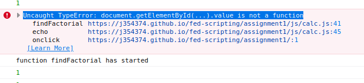

In order to help troubleshoot the code for now the line has been commented out:

```
/*	document.getElementById("factorial").value(fact);*/
```


The following is now produced in the console. 
:flashlight:

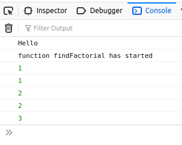


The line that was commented out has been rewritten as:


```
document.getElementById("factorial").value = fact;
```
:fireworks:
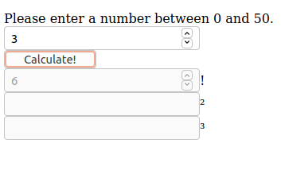

## References

<a id="1">[1]</a> 
W3 schools (2020). \
Define an HTML Table \
https://www.w3schools.com/html/html_tables.asp

<a id="2">[2]</a> 
W3 schools (2020). \
HTML Forms \
https://www.w3schools.com/html/html_forms.asp

<a id="3">[3]</a> 
W3 schools (2020). \
HTML button Tag \
https://www.w3schools.com/tags/tag_button.asp

<a id="4">[4]</a>	
W3 schools (2020). \
HTML input disabled Attribute \
https://www.w3schools.com/tags/att_input_disabled.asp

<a id="5">[5]</a>
W3 schools (2020). \
Complete HTML 4 Entity Reference \
https://www.w3schools.com/charsets/ref_html_entities_4.asp

<a id="6">[6]</a>
W3 schools (2020). \
onclick Event \
https://www.w3schools.com/jsref/event_onclick.asp

<a id="7">[7]</a>
W3 schools (2020). \
JavaScript functions \
https://www.w3schools.com/js/js_functions.asp

<a id="8">[8]</a>
W3 schools (2020). \
The HTML script Tag
https://www.w3schools.com/html/html_scripts.asp

<a id="999">[999]</a> 
W3 schools (2020). \
JavaScript Operators Reference,\
Comparison Operators\
https://www.w3schools.com/jsref/jsref_operators.asp


references


https://stackoverflow.com/questions/7789521/how-to-link-external-javascript-file-onclick-of-button

https://www.w3schools.com/js/js_comments.asp

https://www.w3schools.com/jsref/jsref_isnan_number.asp

https://stackoverflow.com/questions/25176459/is-number-isnan-more-broken-than-isnan

https://www.w3schools.com/jsref/jsref_isinteger.asp

https://www.informit.com/articles/article.aspx?p=131025&seqNum=3

https://www.w3schools.com/jsref/jsref_operators.asp

https://developer.mozilla.org/en-US/docs/Web/HTML/Element/input/number

https://www.w3schools.com/tags/att_input_type_number.asp

https://www.geeksforgeeks.org/form-validation-using-html-javascript/

https://www.w3schools.com/js/js_if_else.asp

https://www.w3schools.com/js/tryit.asp?filename=tryjs_validation_number

https://www.w3schools.com/jsref/met_document_getelementbyid.asp

https://www.w3resource.com/javascript-exercises/javascript-recursion-function-exercise-1.php

https://www.educative.io/edpresso/how-to-find-the-factorial-of-a-number-in-javascript

https://stackoverflow.com/questions/3959211/what-is-the-fastest-factorial-function-in-javascript

https://www.w3schools.com/js/js_function_invocation.asp
