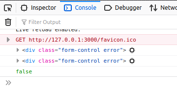

:beginner:\
Portfolio Activity - Assessment 2 - Major Project\
Name: Christopher Paul Caston\
Student id: j354374

## Website Audience

The audience is job seekers especially those for whom the income from a job would improve their standard of living. It site is to be used by people who are keen to work but are struggling with standard recruitment processes. The concept is that we flip recruitment so that workers are much more informed and empowered. We tell them where the work is and where the labour shortages are by data mining the information from publicly available sources such as the Australian Bureau of Statistics. The website also gives job seekers a listing of the core skills needed for a job to help them find the work they are suitable for.

## Implement the Form with validation and determine what functional features you will use JavaScript to implement into the project website

The validation checks that the user has entered valid contact information such as name, email address, phone number and postcode. It also asks for a subject reason
for submitting the form. The subject is specific to this project and not used on the previous one.

## Determine what social media your project requires to be integrated into the website and document what would work best for you.

The project requires LinkedIn in integration as people use that site when they are looking for work and furthering their career. The site also has twitter integration as
that is a widely used micro-blogging service that can disseminate information very rapidly.

## Provide an explanation of the benefits and negative aspects of the social media you would recommend for your site

The benefits are that information from the website can reach a wider audience by spreading through the social networks and directly being seen by the contacts
and followers of the website user.

## Create a social media guideline detailing what would be the indicators of a successful implementation of social media into your site

Social media metrics are similar to Key Performance Indicators for other parts of the business. Each social media site provides analytics for example in Twitter these are available to all users. Instragram and Pinterest require you to establish a business account first.

The metrics of highest importance are:

    • Engagement e.g. Likes, comments, shares and clicks, retweets
    • Awareness: Impressions and reach
    • Volume and sentiment
    • ROI: Referrals & conversions
    • Customer care: Response rate & time

## Integrate social media and JavaScript functionality so that is does not distract from the overall design yet is a part of it.
The integration is quite clean. Discreet share buttons appear for Twitter and LinkedIn when the website user chooses a job role and a link to a page width more information
is rendered. The share buttons now allow that information to be shared to their social network.


## Implement chosen JavaScript functionality by creating the code required, customising the HTML/CSS as needed, Debug, document and test, keeping a record of what was done.

The form has been integrated with the projects contact page. The buttons were updated so that they maintained the existing site theme and were the same as on the previous contact form. A comments textarea has been added. At first there was a bug with this that about 4 blank spaces were added to the textarea but this was fixed by putting the opening and closing tags directly adjacents with no spaces between them.

The JavaScript file (register.js) was updated so that these fields could be handled including the validation.

There were many undefined variables and warnings in jshint as follows:


This has been fixed by moving the const statements out of the checkInputs function and into global declarations at the top.


We need to ensure that once all the checks pass the form is ready to submit. I have created a new variable:
```
var submitReady = true;
```
at each error it sets:

```
submitReady = false;
```

and to test this we added
```
console.log(submitReady);
```

And we can see it's working:


so now we add:

```
if (submitReady == true ) {
  form.submit();
}
```
and the form now submits.

There was another issue that the comments textarea was showing a red border.

I entered a console log entry for formControl:



After a number of trial and errors I created the following functions specific to the textarea box:

```

function tsetErrorFor(textarea, message) {
    const formControl = textarea.parentElement;
    const small = formControl.querySelector('small');
    formControl.className = 'form-control error';
    small.innerText = message;
}

function tsetSuccessFor(textarea) {
    const formControl = textarea.parentElement;
    formControl.className = 'form-control success';
}
```

and added the following to the CSS file:

```
.form-control.success textarea {
	border-color: #2ecc71;
}

.form-control.error textarea {
	border-color: #e74c3c;
}
```
We can now see it working as intended.

Filling all the fields in correctly showed the green outline then submitted the form before I could take a screenshot.

One last check with jshint:


## Integrate two chosen ways for the social media into the site, Debug/validate, document and test as you go keeping a record of what was done.

The two chosen implementations are the Twitter and LinkedIn share buttons.

## Script code layout (Bottom Up design, must have Event Listeners – NO onclick in HTML, all JavaScript is separated to external file and js script tag must be at the bottom of the html before the end body tag)

There is no onclick javascript or jsx in the HTML files. The scripts are referenced at the end right before each body tag.

## Test in at least two different browsers and show client for sign-off.
Microsoft Edge:


Google Chrome:


## references

Javascript Form Validation Tutorial
https://www.youtube.com/watch?v=wvcORaD1MoI

https://stackoverflow.com/questions/60819238/js-form-validator-before-submit-not-working

https://www.w3schools.com/jsref/met_form_submit.asp

https://stackoverflow.com/questions/26521331/event-listeners-to-form-label

https://stackoverflow.com/questions/6319799/regex-for-validating-postcode-and-phone-numberjs

https://www.w3schools.com/Jsref/event_onmouseover.asp

http://michaelsoriano.com/better-tooltips-with-plain-javascript-css/


https://accessibility.athena-ict.com/aria/examples/tooltip.shtml

https://stackoverflow.com/a/15703312/12822663

Tooltip javascript position static forEach
https://codepen.io/j354374/pen/oNLaYXp


http://beautifytools.com/javascript-beautifier.php

https://www.w3schools.com/jsref/prop_node_textcontent.asp

https://developer.twitter.com/en/docs/twitter-for-websites/tweet-button/guides/javascript-factory-function

https://docs.microsoft.com/en-us/linkedin/consumer/integrations/self-serve/plugins/share-plugin

https://stackoverflow.com/questions/14596164/adding-a-script-tag-to-the-dom-with-javascript-in-ie-with-data-attribute

https://www.w3schools.com/jsref/met_element_setattribute.asp

https://developer.twitter.com/en/docs/twitter-for-websites/tweet-button/overview


An image from an underground mining vehicle was included from Wikipedia. Please see:
https://en.wikipedia.org/wiki/Underground_mining_(soft_rock)
https://en.wikipedia.org/wiki/Underground_mining_(soft_rock)#/media/File:VKG_Ojamaa_kaevandus.jpg

Icons provided by Icofont(https://icofont.com/). Background images from SVG Patterns Gallery(https://philiprogers.com/svgpatterns/), SVG Backgrounds (https://www.svgbackgrounds.com/#flat-mountains) and the cloud header was from loading.io. (https://loading.io/background/m-clouds)

original skills.js script was written by mplungjan (online alias) in response to the following [stackoverflow question](https://stackoverflow.com/questions/64661591/use-javascript-to-create-hyperlink-from-html5-details-summary-data-element/64661875#64661875)
please also see the codepen:
https://codepen.io/j354374/pen/WNxyReJ

HTML/CSS tables were written with reference to the following [codepen](https://codepen.io/AllThingsSmitty/pen/MyqmdM) by [Matt Smith](https://codepen.io/AllThingsSmitty).
