:beginner:\
Portfolio Activity - Task 4 – Working with Forms\
Name: Christopher Paul Caston\
Student id: j354374

- [ Part 1: Project setup](#stage-1-)
- [ Part 2: Instruction 1](#stage-2-)
-


## Part 1:
&#x1F535;

## Changes to HTML code.

I will modify the HTML as follows. First I change the id of the div to "form-control" as this is more descriptive and I simplify the id of the form to simply "form".
I remove the required attributes from inputs as we are learning JavaScript not HTML5. I will, however, add placeholders to help describe what should be entered into each field. This is not a replacement for the tooltips that will be added later.

I am going to do a simplified version without the tool-tips then I will add them at the end.

I will also change the input selector to shows Australian states. I have run the new code through the w3 Nu Html Checker and it gave the message: "Document checking completed. No errors or warnings to show."

Please see the modified code as follows:


```
<!doctype html>
<html lang="en">
<head>
    <meta charset="utf-8">
    <title>Registration Form</title>
    <link rel="stylesheet" href="css/newform.css">
</head>
<body>
    <!-- register.html -->
    <form id="form" class="form">
		  <fieldset><legend>Register</legend>
			<p>All fields are required.</p>

		<div class="form-control">
			<label for="firstName">First Name</label><input type="text" placeholder="First name" id="firstName">
			<i class="fas fa-check-circle"></i>
			<i class="fas fa-exclamation-circle"></i>
			<small>Error message</small>
		</div>

				<div class="form-control">
			<label for="lastName">Last Name</label><input type="text" placeholder="Last name" id="lastName">
			<i class="fas fa-check-circle"></i>
			<i class="fas fa-exclamation-circle"></i>
			<small>Error message</small>
		</div>


		<div class="form-control">
			<label for="email">Email</label>
			<input type="email" placeholder="username@example.com" id="email" />
			<i class="fas fa-check-circle"></i>
			<i class="fas fa-exclamation-circle"></i>
			<small>Error message</small>
		</div>

	<div class="form-control"><label for="phone">Phone Number</label><input type="text" name="phone" id="phone">
		<i class="fas fa-check-circle"></i>
			<i class="fas fa-exclamation-circle"></i>
			<small>Error message</small>
	</div>

<div class="form-control"><label for="city">City</label><input type="text" name="city" id="city">
	<i class="fas fa-check-circle"></i>
			<i class="fas fa-exclamation-circle"></i>
			<small>Error message</small>
</div>

	<div class="form-control"><label for="state">State</label><select name="state" id="state">
				<option value="NA">Select a State</option>
				<option value="WA">Western Australia</option>
				<option value="SA">South Australia</option>
				<option value="NT">Northern Teritory</option>
				<option value="QLD">Queensland</option>
				<option value="NSW">New South Wales</option>
				<option value="VIC">Victoria</option>
		<option value="TAS">Tasmania</option>
		<option value="ACT">Canberra</option>
			</select>
		<i class="fas fa-check-circle"></i>
			<i class="fas fa-exclamation-circle"></i>
			<small>Error message</small>

			</div>
			  	<div class="form-control"><label for="zip">Zip Code</label><input type="text" name="zip" id="zip">
<i class="fas fa-check-circle"></i>
			<i class="fas fa-exclamation-circle"></i>
			<small>Error message</small>


			  	</div>
			  <div class="form-control"><input type="checkbox" name="terms" id="terms"> I agree to the terms, whatever they are.
<i class="fas fa-check-circle"></i>
			<i class="fas fa-exclamation-circle"></i>
			<small>Error message</small>
			  </div>

			  <br>


			  <button>Submit</button></fieldset>

	</form>
    <script src="js/register.js"></script>
</body>
</html>

```
I have also updated name of the div two to form-control in the newform.css CSS file and to display the green ticks and red explanation signs I have added a call to font awesome:
@import url('https://cdnjs.cloudflare.com/ajax/libs/font-awesome/5.10.2/css/all.min.css');

I will also add a few other changes to the CSS to better illustrate when the input is valid or invalid.

I have re-written the window.onload function as follows:

```
// Establish functionality on window load:
window.onload = function() {
    'use strict';
//make a link to each from elementById
    const form = document.getElementById('form');

    const email = document.getElementById('email');

    const firstName = document.getElementById('firstName');
    const lastName = document.getElementById('lastName');
    const phone = document.getElementById('phone');
    const city = document.getElementById('city');
    const state = document.getElementById('state');
    const zip = document.getElementById('zip');
    const terms = document.getElementById('terms');
//add an event listener to the form. On submit call function e and stop the page from reloading
    form.addEventListener('submit', e => {
    	e.preventDefault();
//now call the checkInputs function
    	checkInputs();
    });

};

```

I have re-written the checkInputs function as follows:

```
function checkInputs() {
	// trim to remove the whitespaces

	const emailValue = email.value.trim();

	const firstNameValue = firstName.value.trim();
	const lastNameValue = lastName.value.trim();
	const phoneValue = phone.value.trim();
	const cityValue = city.value.trim();
	const stateValue = state.value.trim();
	const zipValue = zip.value.trim();
	const termsValue = terms.value;


		if(firstNameValue === '') {
		setErrorFor(firstName, 'First name cannot be blank');
	} else if (!isfirstName(firstNameValue)) {

		setErrorFor(firstName, 'Not a valid first name');
	} else {
		setSuccessFor(firstName);
	}

			if(lastNameValue === '') {
		setErrorFor(lastName, 'Last name cannot be blank');
  } else if (!islastName(lastNameValue)) {

    setErrorFor(lastName, 'Not a valid last name');
	} else {
		setSuccessFor(lastName);
	}


	if(emailValue === '') {
		setErrorFor(email, 'Email cannot be blank');
	} else if (!isEmail(emailValue)) {
		setErrorFor(email, 'Not a valid email');
	} else {
		setSuccessFor(email);
	}


			if(phoneValue === '') {
		setErrorFor(phone, 'Phone cannot be blank');
	}  else if (!isPhone(phoneValue)) {
		setErrorFor(phone, 'Not a valid Aust phone number');
	} else {
		setSuccessFor(phone);
	}


				if(cityValue === '') {
		setErrorFor(city, 'City name cannot be blank');
	} else {
		setSuccessFor(city);
	}

					if(stateValue === "NA") {
		setErrorFor(state, 'Please select a state');
	} else {
		setSuccessFor(state);
	}

					if(zipValue === "") {
		setErrorFor(zip, 'Please enter a zip code');
	} else if (!isZip(zipValue)) {
		setErrorFor(zip, 'Not a valid Aust zip code');
	} else {
		setSuccessFor(zip);
	}

	if(!terms.checked) {
		setErrorFor(terms, 'Please agree to the terms');
	} else {
		setSuccessFor(terms);
	}


} //end function check inputs
```
I found an issue in jshint that the isLastname function was not used. I have forgotten to code in that particular check so I have done so now and this is updated in the code above too.

Please note in the instructions it makes a specific reference to "Allow for the form’s element label to have more than one class- one for error(red) and one for correct(green) and a tick."

This happens here:

```
//set the form element label to have more than one class e.g. error (red) or success (green)

function setErrorFor(input, message) {
	const formControl = input.parentElement;
	const small = formControl.querySelector('small');
	formControl.className = 'form-control error';
	small.innerText = message;
}

function setSuccessFor(input) {
	const formControl = input.parentElement;
	formControl.className = 'form-control success';
}
```

To make the code cleaner I have started replacing the if else statements with ternary operators.
For example:

```
	if(!terms.checked) {
		setErrorFor(terms, 'Please agree to the terms');
	} else {
		setSuccessFor(terms);
	}
```
is now:
```
!terms.checked ? setErrorFor(terms, 'Please agree to the terms') : setSuccessFor(terms);
```

In the next step I tried to convert the if else for the postcode to a switch statement.
```

					if(zipValue === "") {
		setErrorFor(zip, 'Please enter a zip code');
	} else if (!isZip(zipValue)) {
		setErrorFor(zip, 'Not a valid Aust zip code');
	} else {
		setSuccessFor(zip);
	}
```
to
```
switch (zipValue) {
	case "":
	setErrorFor(zip, 'Please enter a zip code');
	break;
	case !isZip(zipValue):
	setErrorFor(zip, 'Not a valid Aust zip code');
	break;
	default:
	setSuccessFor(zip);
	break;
}
```

However this does not work as isZip(zipValue) is always going to return a boolean. The switch statement is also using more lines of code than if, else if, else which
negates the point of making our code smaller. I will continue on with setting up the tooltips.

I have added the script src to the utilities.js file in the register.html file and I have called it as follows:
// Enbable tooltips on the phone number:
U.enableTooltips('phone');

Unfortuantely this gives a type error as shown:
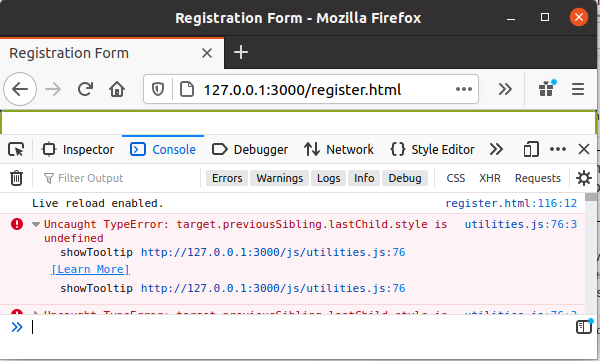

"Uncaught TypeError: target.previousSibling.lastChild.style is undefined"

This happens when you mouseover the phone field. I am unsure how to fix this error but I know a much quicker way of creating the tooltip that will use much less code.
First I will edit the register.html file again to add an info icon to each field and put the text I want to show inside a span and div. The div is so I can give the tooltop a background and set the dimensions.


next I will add the info icon after the email, phone number, city and zip code fields for example:

```
<a class="tooltip">
    
    <span>
      <div class="infobox">Enter a 10 digit phone number including area code.</div>
    </span>
</a>
```


and the following to the register.js file init function:

```
var tooltips = document.querySelectorAll('.tooltip span').forEach(item => {
  item.addEventListener('mouseover', event => {
    tooltips.style.top = '40px';
     tooltips.style.left = '80px';   
  })
})

```
This was originally based on the stack exchange example called [Tooltip position relative to mouse pointer](https://stackoverflow.com/a/15703312/12822663) given by [Daniel Imms](https://stackoverflow.com/users/1156119/daniel-imms) but I have modified it change the onmousemove to a mouseover, remove the dynamic elements and change the for loop to a forEach. I also used the arrow function short syntax which is only supported in ECMAscript 6 and above. If we want to support earlier browsers such as IE 11 we would need to include a polyfill.

This was tested in the following codepen [Tooltip javascript position static forEach](Tooltip javascript position static forEach)

I have also added the following css to the newform.css file:

```
.tooltip {
    text-decoration:none;
    position:relative;
}
.tooltip span {
    display:none;
}
.tooltip:hover span {
    display:block;
    position:fixed;
    overflow:hidden;
}

.infobox
{
background: pink;
padding: 0.5%;    
width: 290px;
height: 40px;
display: block;
}
```
I found a problem that the code wasn't actually working.
I had some error messages in the console such as "TypeError: EventTarget.addEventListener: At least 2 arguments required, but only 1 passed" and "SyntaxError: expected expression, got ')'"

I was able to fix the issue with the code as follows:

```
var tooltips = document.querySelectorAll('.tooltip span');
tooltips.forEach(item => {
  item.addEventListener('mouseover', event => {
    tooltips.style.top = '190px';
    tooltips.style.left = '290px';
    console.log('1');
  })
})
```
This removed the errors, however, it wasn't actually running the code to change the tooltips style properties for the top and left coordinates. It wasn't logging 1 to the console.


I have reverted to an earlier version of the code that uses the for loop instead of the forEach statement:

```
var tooltips = document.querySelectorAll('.tooltip span');

window.onmousemove = function (e) {
    for (var i = 0; i < tooltips.length; i++) {
        tooltips[i].style.top = '190px';
        tooltips[i].style.left = '30px';
      console.log("1");
    }
};
```

As we can see from the following screenshot:

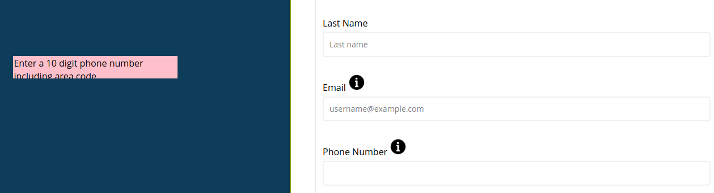

We need to make the div box higher and adjust the x and y dimensions.
They have been changed to the following:

```
tooltips[i].style.top = '440px';
tooltips[i].style.left = '30px';
```
I have setup the configure options in jshint as follows:

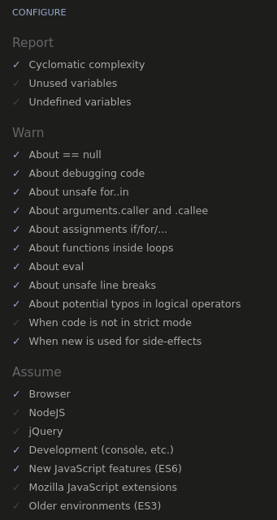

There is one warning. For some reason it doesn't like the ternary statement I used and gives the message:
"Expected an assignment or function call and instead saw an expression."

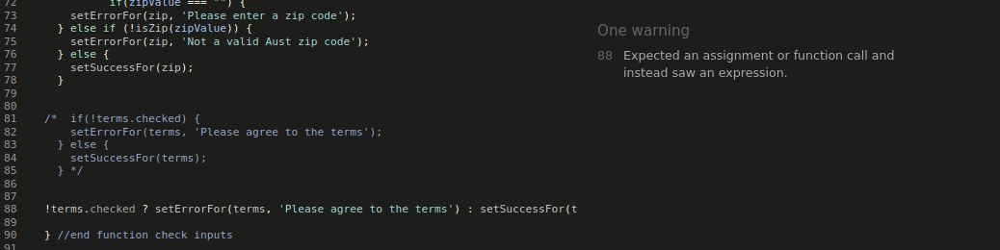

I can simply comment it out and return to the original if else statement.
As shown in the following screenshot:


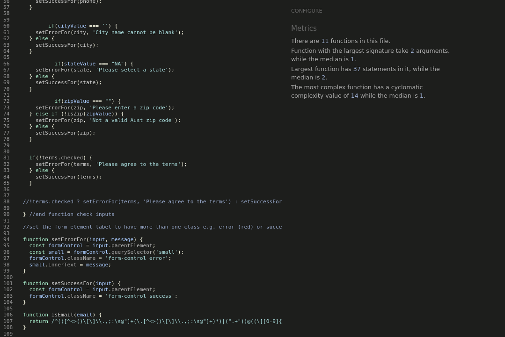

I have also run the code through https://beautifier.io/ and saved a backup copy of the pre-beautified code.

Please see the following screenshots as evidence of testing in Firefox:

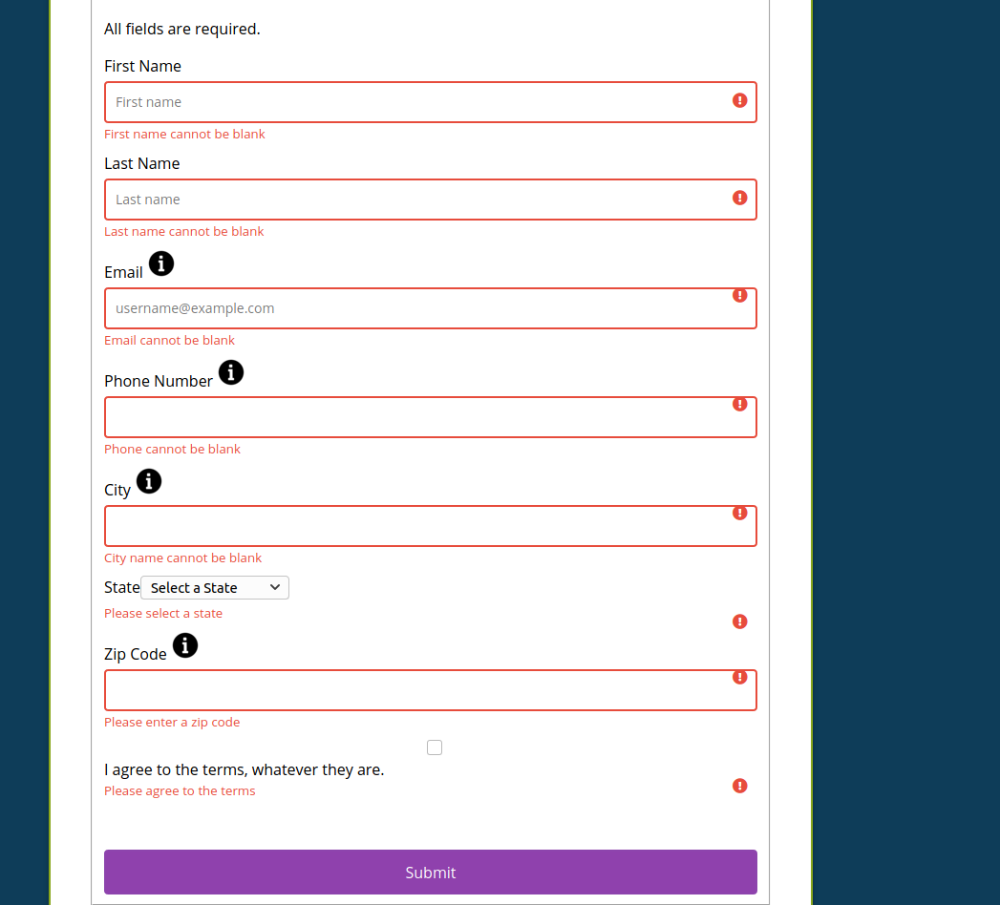
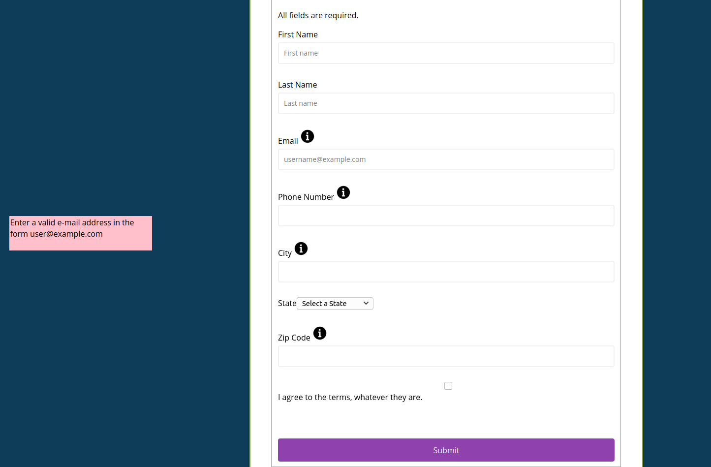
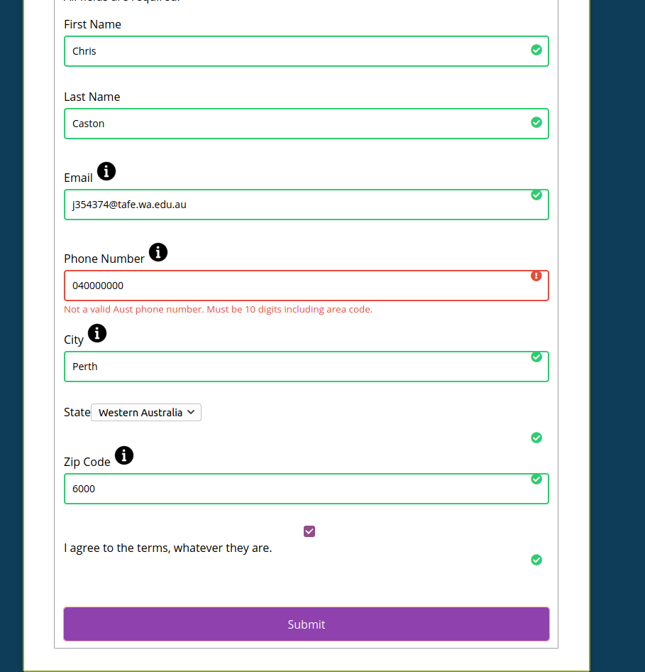
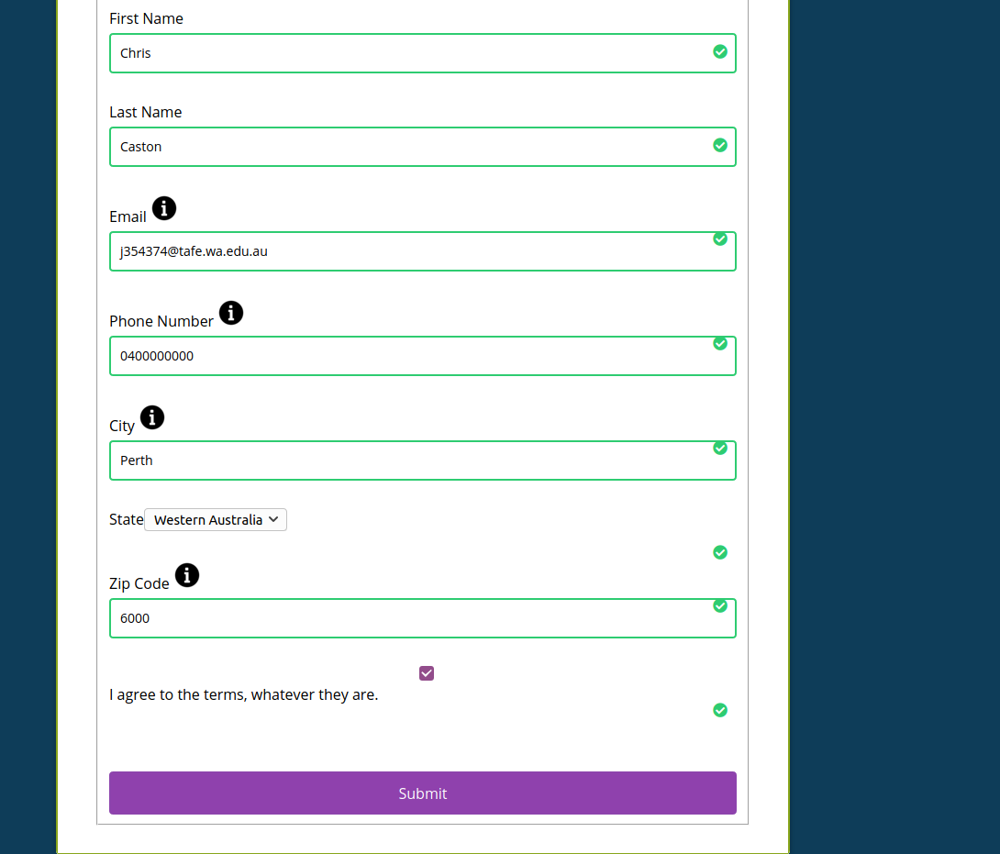
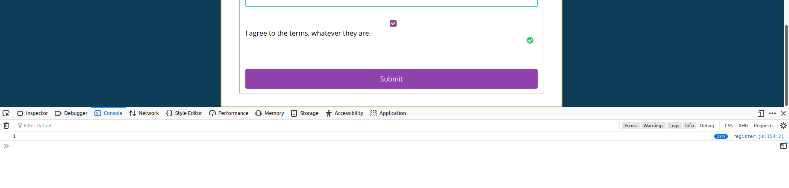

Please see the following screenshots as evidence of testing in Chrome:

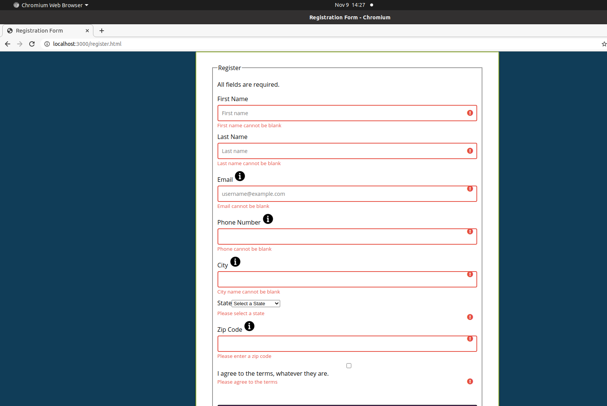
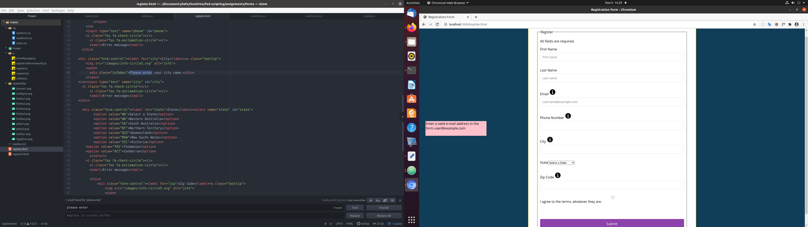
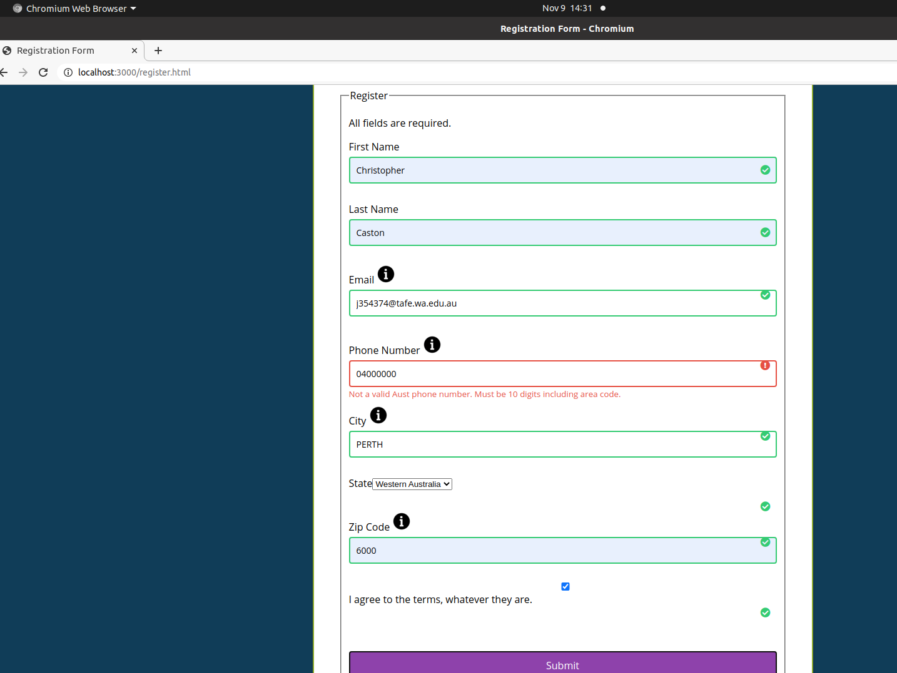
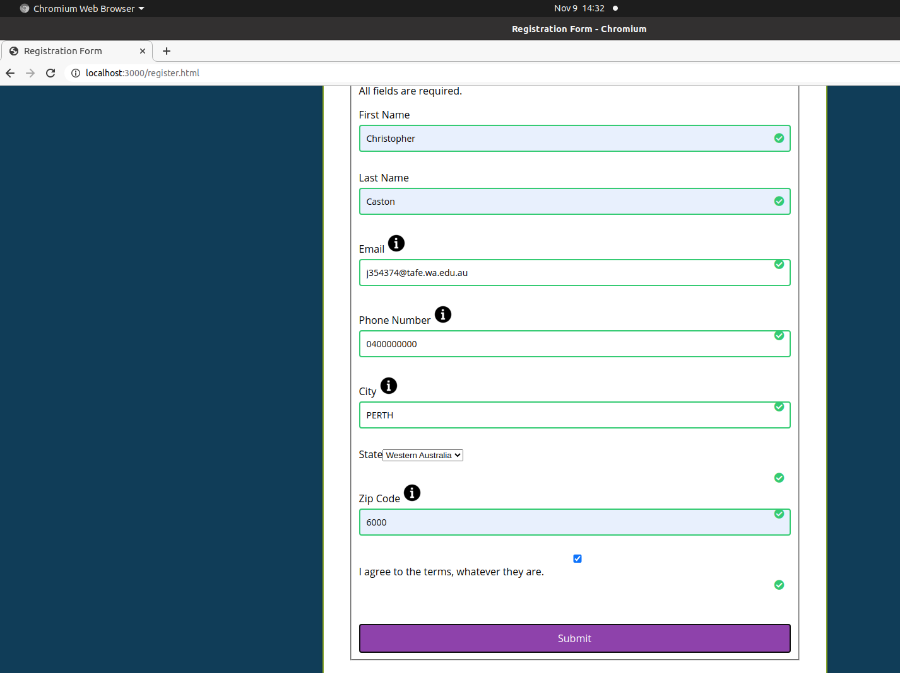
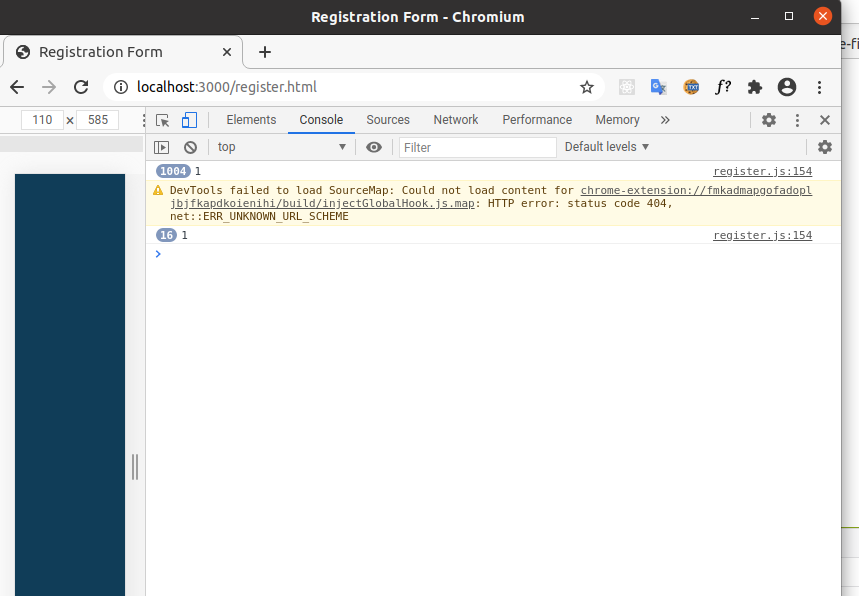

## references
Javascript Form Validation Tutorial
https://www.youtube.com/watch?v=wvcORaD1MoI

https://stackoverflow.com/questions/26521331/event-listeners-to-form-label

https://stackoverflow.com/questions/6319799/regex-for-validating-postcode-and-phone-numberjs

https://www.w3schools.com/Jsref/event_onmouseover.asp

http://michaelsoriano.com/better-tooltips-with-plain-javascript-css/


https://accessibility.athena-ict.com/aria/examples/tooltip.shtml

https://stackoverflow.com/a/15703312/12822663

Tooltip javascript position static forEach
https://codepen.io/j354374/pen/oNLaYXp
