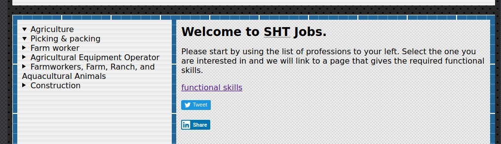
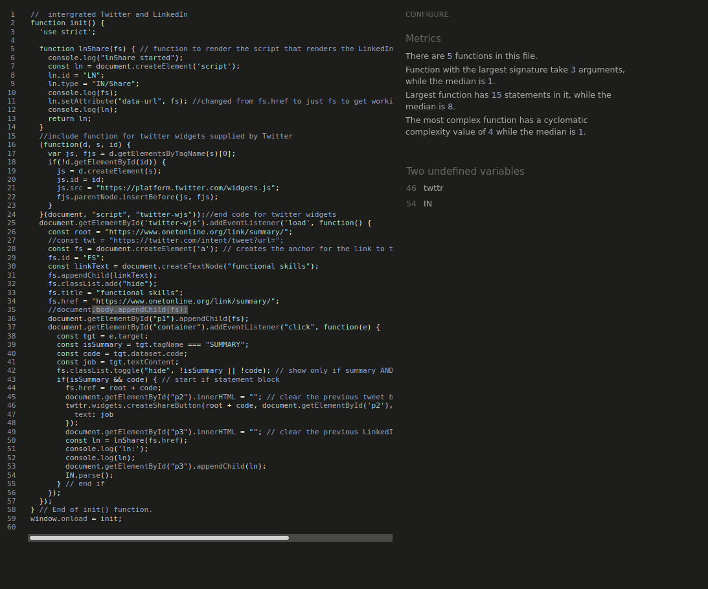
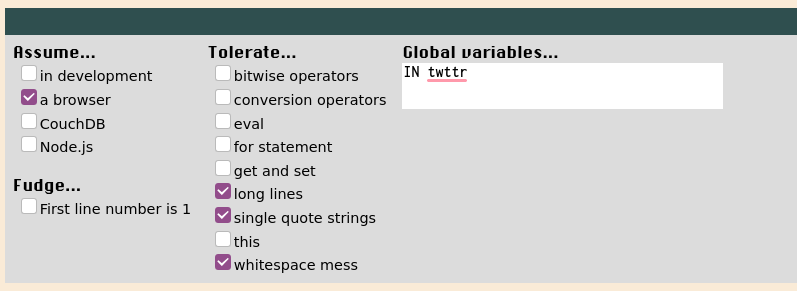
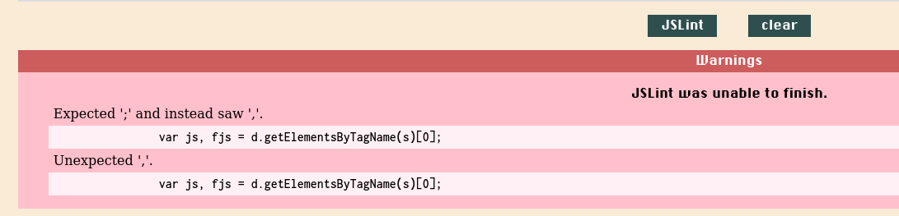
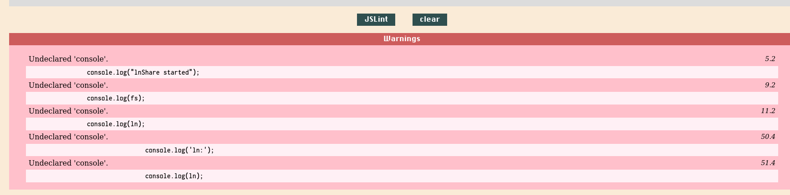
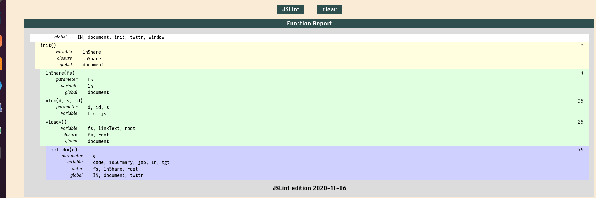
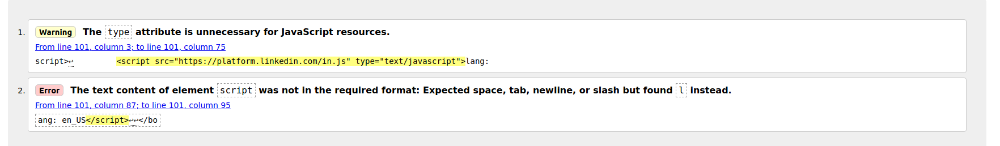

:beginner:\
Portfolio Activity - Portfolio Activity - Task 7 - Social Media Integration \
Name: Christopher Paul Caston\
Student id: j354374\
Project URL: https://j354374.github.io/fed-scripting/project-task7-4page-site/

## Website Audience

The audience is job seekers especially those for whom the income from a job would improve their standard of living. It site is to be used by people who are keen to work but are struggling with standard recruitment processes. The concept is that we flip recruitment so that workers are much more informed and empowered. We tell them where the work is and where the labour shortages are by data mining the information from publicly available sources such as the Australian Bureau of Statistics. The website also gives job seekers a listing of the core skills needed for a job to help them find the work they are suitable for.

##  The implementation may be share/like buttons, a feed from social media / network page and/or a follow me button

The index page shows a listing of industries (only two for now but it can be expanded) and when you click on the arrow it expands a list of roles in that industry.
If you click on the role is shows a hyperlink to a webpage with a list of functional skills required for that role. Javascript embedded in the website renders a Twitter and LinkedIn share button. These were built use the code provided by Twitter and Microsoft and integrated with the website using additional Javascript code developed for this purpose.



Please note an earlier version of the twitter button was rendered using the JavaScript document object model but it could only create the hyperlink. When the twitter code snippet was called that renders the share button it broke the code.

Please see the following stackoverflow:

https://stackoverflow.com/questions/64923081/using-twitter-widgets-with-html-anchor-a-tag-rendered-by-javascript

The solution was to use twttr.widgets.createShareButton to create the share button rather than coding it myself.

##    Implementation must take into consideration the social media guidelines you have created and implemented for your client as well as coding principles and best practice according to industry standards.

Yes, all Javascript including onclick handlers is removed from the HTML file. The Javascript loaded using the init function and window.onload.
It adheres to the social media guidelines as it provides them with current and reliable information and does not contravene any consumer laws.

##    Code is to be validated & tested before uploading for assessment.

The code has been tested in Chrome and Firefox. The HTML5 data and summary tags required a polyfill to work in IE and Edge.
The social media share buttons do not work in IE 11 but they do work in Edge.


Code has been validiated in jshint:

Please note that it didn't recognise the variables IN and twttr but these are called from different scripts developed by Microsoft and Twitter. One is called from the HTML file and the other is called from Twitter's code snippet.

I ran jslint against the code with the following options:



and got this in response:


Please note that those lines are from the twitter code snippet. Although I assume this is not a concern it does also say "JSLint was unable to finish."
The following stackoverflow article sheds some light on this issue:
https://stackoverflow.com/questions/34862541/expected-and-instead-saw-jslint-multivar-setting

In the version in jslint (but not the main code) I have changed the lines to following:
```
var js;
var fjs = d.getElementsByTagName(s)[0];
```                
After running the linter again I got the following output:



It didn't like my console logs. They were only used for troubleshooting and debugging so I no longer need them and they have been removed.

jslint now gives the following function report showing no warnings or errors:




the index.html does give 1 error and 1 warning:




However this is the code verbatim provided by Microsoft:

```
<script src="https://platform.linkedin.com/in.js" type="text/javascript">lang: en_US</script>
```
I don't want to change it in case it breaks the script.

about.html:

contact.html:

data.html:

reports.html:


style-css-validation:


## references

http://beautifytools.com/javascript-beautifier.php

https://www.w3schools.com/jsref/prop_node_textcontent.asp

https://developer.twitter.com/en/docs/twitter-for-websites/tweet-button/guides/javascript-factory-function

https://docs.microsoft.com/en-us/linkedin/consumer/integrations/self-serve/plugins/share-plugin

https://stackoverflow.com/questions/14596164/adding-a-script-tag-to-the-dom-with-javascript-in-ie-with-data-attribute

https://www.w3schools.com/jsref/met_element_setattribute.asp

https://developer.twitter.com/en/docs/twitter-for-websites/tweet-button/overview


An image from an underground mining vehicle was included from Wikipedia. Please see:
https://en.wikipedia.org/wiki/Underground_mining_(soft_rock)
https://en.wikipedia.org/wiki/Underground_mining_(soft_rock)#/media/File:VKG_Ojamaa_kaevandus.jpg

Icons provided by Icofont(https://icofont.com/). Background images from SVG Patterns Gallery(https://philiprogers.com/svgpatterns/), SVG Backgrounds (https://www.svgbackgrounds.com/#flat-mountains) and the cloud header was from loading.io. (https://loading.io/background/m-clouds)

skills.js script was written by mplungjan (online alias) in response to the following [stackoverflow question](https://stackoverflow.com/questions/64661591/use-javascript-to-create-hyperlink-from-html5-details-summary-data-element/64661875#64661875)
please also see the codepen:
https://codepen.io/j354374/pen/WNxyReJ

HTML/CSS tables were written with reference to the following [codepen](https://codepen.io/AllThingsSmitty/pen/MyqmdM) by [Matt Smith](https://codepen.io/AllThingsSmitty).
