:beginner:\
Portfolio Activity - Task 2 – Control Structures\
Name: Christopher Paul Caston\
Student id: j354374

- [ Stage 1: Project setup](#Stage 1:)
- [ Stage 2: Instruction 1](#Stage 2:)
- [ Stage 3: Instruction 2](#Stage 3:)
- [ Stage 4: Instruction 3](#Stage 4:)
- [ References](#references-)

## Stage 1:
&#x1F535;

### directory structure

The project is laid out with the following directory structure:

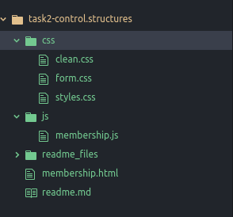

The files clean.css, form.css, styles.css, membership.js and membership.html came from the zip file "Task 2.zip""]" included with the assignment.

## Stage 2: Instruction 1

**Change the discount percentage so that is varies based on the number of years being purchased (that is 10 percent for two or three years, 15 percent for four years and 20 percent for five or more years)**

The first step was to comment out the if statement on lines: 45-48 and then write a switch statement. Please see the following:

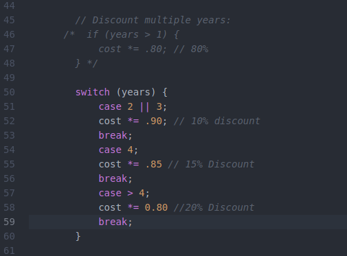

As there were errors in the code the following result was observed in the browser:


Syntax errors were fixed as follows:

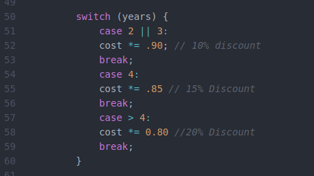

The same error was observed.

After checking the w3 schools website the switch statement was rewritten to have more than one case between each break as follows:
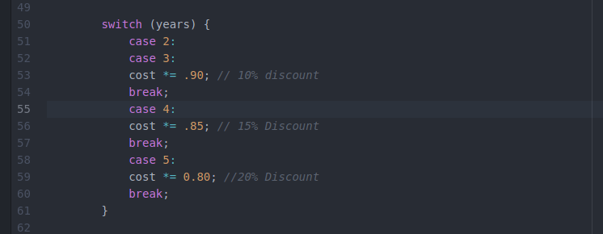

We now see the following for each number of years entered:

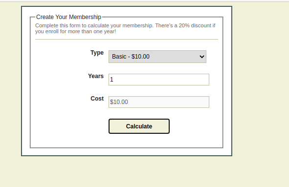
\
(Sorry the third screenshot was lost)\

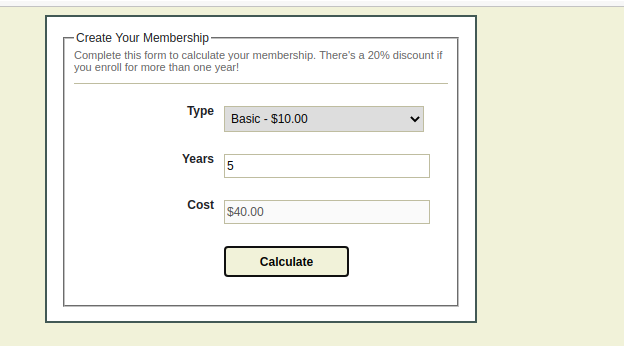
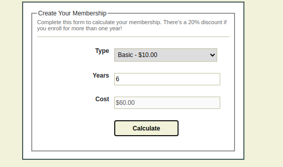

As we see the sixth calculation does not give a discount. Every purchase of membership five years or greater requires the 20% discount.
To achieve this we add an if statement as follows:


We now see the correct output as follows:

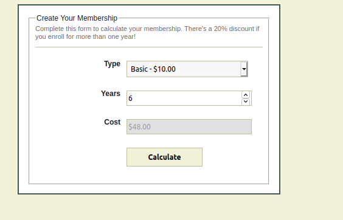


## Stage 3: Instruction 2  
**Change the code so that you use a paragraph or span, along with textContent and innerText, rather than a form element to show the calculation cost of the membership.**

In the membership.html file provided the "Cost" is shown in the following div element:

```
<div>
  <label for="cost">Cost</label>
  <input type="text" name="cost" id="cost" disabled>
</div>
```
"The textContent property returns the text with spacing, but without inner element tags." -reference
To use textContent we need to change set an id inside a span tag as follows:

```
<div>
Your membership cost is <span id="cost-print"></span>
</div>
```

We then add something like the following Java-Script code:

```
document.getElementById('cost-print').textContent = cost;
```
So the following lines need to be changed from:

```

        // Show the total amount:
        document.getElementById('cost').value = '$' + cost.toFixed(2);

    } else { // Show an error:
        document.getElementById('cost').value = 'Please enter valid values.';
    }
```
to:

```
// Show the total amount:
document.getElementById('cost-print').textContent = '$' + cost.toFixed(2);

} else { // Show an error:
document.getElementById('cost-print').textContent = 'Please enter valid values.';
}

```    

We now get the following rendered on the page:

\
and when we enter a number and click "Calculate":\


So now we need to do the same with innerText. The innerText property returns just the text, without spacing and inner element tags.
```
// Show the total amount but using innerText:
document.getElementById('cost-print2').innerText = '$' + cost.toFixed(2);
```
and we add the following html:

```
<div>
Your membership cost is <span id="cost-print2">?</span>
</div>
```
This is not working as expected as showing in the following screenshot:


On closer inspection I hadn't yet added the JavaScript above to the membership.js file.
I have now done so and the code looks like this:

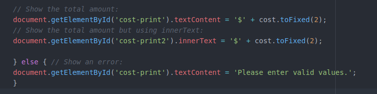

And the screen looks like this:

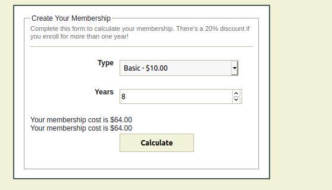

## Stage 4: Instruction 3  
**Test your script in at least two browsers and document any debugging plus version control of your script**

The problems experienced were non-trivial and could be fixed with standard troubleshooting and didn't require the use of the JavaScript console. The troubleshooting steps and code changes were included in the previous sections.

I take this opportunity update the text in the HTML file.

I have changed it to:

```
Complete this form to calculate your membership. There's a 10% discount if you enrol for two or three years, a 15% discount for four years and a 20% discount for five or more years!

```
"Enrol" is the spelling in British English.

I have now validated and fixed small coding errors such as in spacing an indentation using [Code Beautify](https://codebeautify.org/jsvalidate).
The line /*jslint browser:true */ was added to let the validator know the code was running in a browser and accessing the DOM.

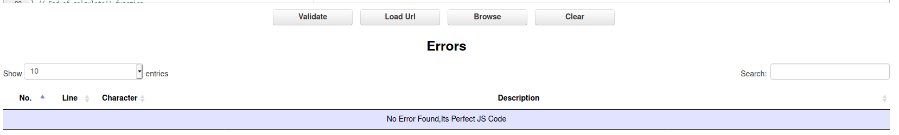

The HTMl file was validated using the [W3 validator service](https://validator.w3.org/) and gave the message: **Document checking completed. No errors or warnings to show.**

Please note the below are GIF animations if (are viewing this offline and) you wish see them running please visit: https://github.com/j354374/fed-scripting/blob/master/task2/readme.md

Example running in Firefox:\
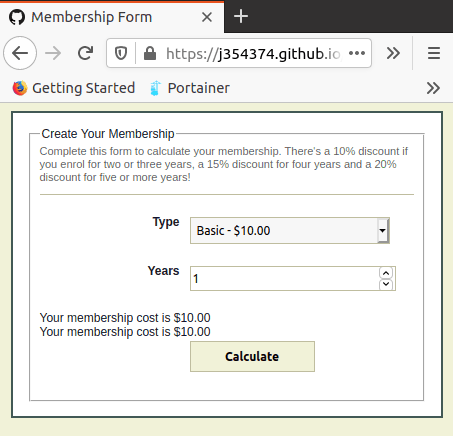

Example running in Chrome:\
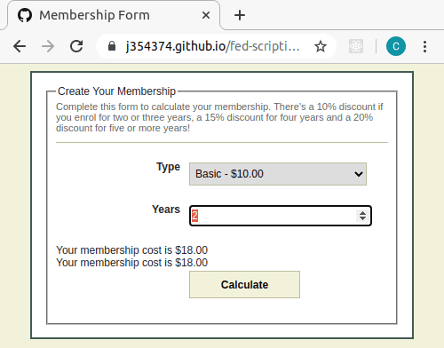

## References


https://www.w3schools.com/js/js_switch.asp \
https://www.w3schools.com/js/js_if_else.asp \
https://www.w3schools.com/jsref/prop_node_textcontent.asp \
https://developer.mozilla.org/en-US/docs/Web/API/Node/textContent \
https://www.w3schools.com/jsref/prop_node_textcontent.asp \
https://developer.mozilla.org/en-US/docs/Web/API/Element/innerHTML \
https://www.w3schools.com/jsref/prop_html_innerhtml.asp 
