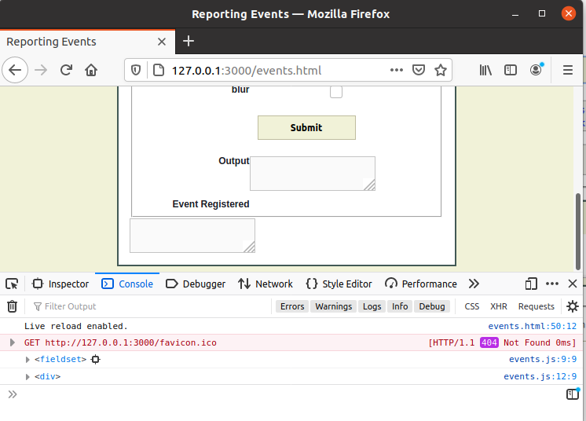

:beginner:\
Assessment 1: Portfolio Activity Task 4 –Event Handling\
Name: Christopher Paul Caston\
Student id: j354374


## Modify the epoch.js file so that a button element is clicked to update the message

I first tried creating a new file called button.js. In this file I entered code to create the button element. I found this code in the following [stackoverflow article].
(https://stackoverflow.com/questions/4793604/how-to-insert-an-element-after-another-element-in-javascript-without-using-a-lib) and modified it for our needs.
Although the code worked it stopped the output element from being updated by the epoch.js file. I was unsure exactly why but ended up putting the function inside the epoch.js file directly.

```
function btninit() { // this function adds a button after the p element with id of output

  /* Adds Element BEFORE NeighborElement */
  Element.prototype.appendBefore = function (element) {
      element.parentNode.insertBefore(this, element);
  }, false;

  /* Adds Element AFTER NeighborElement */
  Element.prototype.appendAfter = function (element) {
      element.parentNode.insertBefore(this, element.nextSibling);
  }, false;

  /* Typical Creation and Setup A New Orphaned Element Object */
  var btn = document.createElement('button');
  btn.id="epochbtn";
  btn.innerHTML = "Update";

  //NewElement.innerHTML = 'New Element';


  /*  Add NewElement BEFORE -OR- AFTER Using the Aforementioned Prototypes */
btn.appendAfter(document.getElementById('output'));

return btn;
} // End of btninit() function.
```
I had also tried the following line:     

```
U.addEvent(U.$('epochbtn'), 'click', updateDuration);
```
That didn't work to update the duration so I instead defined a variable to receive what the function returned. I also setup an addEventListener as follows:

```
// Call the function now:
updateDuration();
//call the function to render the update button
var btn = btninit();
console.log(btn);
// add the event listener for the update button
btn.addEventListener('click', updateDuration);
```
The console log is to ensure that the btn element is returned from the function.\
\

As we can see it's now working as intended. We can now test it in the Firefox browser provided by the Atom (IDE) live server:


Please see the following:\
\
Press Update:\


And now we test in Google Chrome:

Please see the following:\
\
Press Update:\


When I check the code in jshint the only warnings come from the code from stackoverflow on lines 10 and 15. The code is working fine so I haven't made any changes.
The undefined variables are for U which was called from the utilities.js file.


There is a newer method of doing this (adding adjacent nodes) for 2020 but it would require a polyfill on older browsers such as Internet Explorer. Please see ChildNode.after():
https://developer.mozilla.org/en-US/docs/Web/API/ChildNode


## Update document to resemble mockup

So according to the mockup provided we need to create another textbox in the index.html file to notify the user when the event handler has been registered. This time we will use the newer method of ChildNode.After(); to create a new HTML element. Although IE is not supported we can add a [polyfill](https://github.com/seznam/JAK/blob/master/lib/polyfills/childNode.js) and then test it on a Windows 10 machine that has both IE and Edge available.

So I have created the following function in the events.js file:

```
function infoinit() {
//This is the existing textarea element
const el = document.getElementById("output");
const newEl = document.createElement("textarea");
newEl.id = "textarea";
newEl.disabled = true; // set the boolean attribute for disabled to true as it can't be done by setAttribute
el.after(newEl); //render the new element
}
```

I then called the function as follows:

```
window.onload = function() {
    'use strict';
    U.$('theForm').onsubmit = setHandlers;
    infoinit();
};
```

Now we can see the following on the rendered HTML page:


It's good but not quite what we need. We need to put it inside a div as well as create a label too.
The div will be a child element of fieldset.

I have tried the following code:
```
function infoinit() {
// This is the existing textarea element
const newDiv = document.createElement("div");
const fieldEl = document.getElementsByTagName("fieldset");
console.log(fieldEl);
newDiv.innerHTML = "new div";
fieldEl.after(newDiv);


//const el = document.getElementById("output");
//const newEl = document.createElement("textarea");
//newEl.id = "textarea";
//newEl.disabled = true; // set the boolean attribute for disabled to true as it can't be done by setAttribute
//el.after(newEl); // render the new element
}
```
But I am getting an error as follows: "Uncaught TypeError: fieldEl.after is not a function":


If I try appendChild instead I get the message: "Uncaught TypeError: fieldEl.appendChild is not a function"

I have added a [0] to the getElementsByTagName line as follows:
"const fieldEl = document.getElementsByTagName("fieldset")[0];"

and it is now working as shown:


We still have more work to do to get the page looking like the mockup:

I have further developed the infoinit function as follows:
```
function infoinit() {
// This is the existing textarea element
const newDiv = document.createElement("div");
const fieldEl = document.getElementsByTagName("fieldset")[0];
const newLabel = document.createElement("label");
newLabel.innerHTML = "Event Registered";
console.log(fieldEl);
//newDiv.innerHTML = "new div";
//fieldEl.after(newDiv);
console.log(newDiv);
fieldEl.appendChild(newDiv);
newDiv.appendChild(newLabel);

//const el = document.getElementById("output");
const newEl = document.createElement("textarea");
newEl.id = "textarea";
newEl.disabled = true; // set the boolean attribute for disabled to true as it can't be done by setAttribute
fieldEl.after(newEl); // render the new element
}
```
Please see the resulting rendered html:


For some reason the textarea is outside the square border. I have now changed the line to
"fieldEl.appendChild(newEl); // render the new element" and we get a much better result:


I have now set "newEl.innerHTML = "none";
and "return newEl;"

The window onload function is now as follows:

```
window.onload = function() {
    'use strict';
    U.$('theForm').onsubmit = setHandlers;
    var newEl = infoinit();
};
```
This allows us to update the innerHTML for the new element from outside the function.

## Modify the events.js file so that it notifies the user when the form has been submitted and the event handlers have been registered

### notify user that event has been registered

I have added an eventListener for fieldset to the window load function and it now looks like this:

```
window.onload = function() {
    'use strict';
  U.$('theForm').onsubmit = setHandlers;

    var newEl = infoinit();

    document.getElementsByTagName("fieldset")[0].addEventListener("change",function()
{
console.log("update");
})
};
```
Please see the rendered page:


I have now added an if else statement with the e function as follows:

```
var checkbox = document.getElementsByTagName("fieldset")[0].addEventListener("change",function(e)
{

  if(e.target.checked) {
          // Checkbox is checked..
          console.log ("checked");
          console.log(e.target.id);
      } else {
          // Checkbox is not checked..
         console.log ("unchecked");
         console.log(e.target.id);
      }

})
```


and now:

```
var checkbox = document.getElementsByTagName("fieldset")[0].addEventListener("change",function(e)
{

  if(e.target.checked) {
          // Checkbox is checked..
          console.log ("checked");
          console.log(e.target.id);
          newEl.innerHTML = e.target.id;

      } else {
          // Checkbox is not checked..
         console.log ("unchecked");
         console.log(e.target.id);
         newEl.innerHTML = "none";
      }

})
```
That updates the event registered textarea with the item checked and sets it back to none when unchecked.

\
\

### Notify the user when the form has been submitted

I have added the following line to the setHandlers() function just before the return false:

```
alert("Form has been submitted");
```
\

## Modify the events.js file so that it uses addEvent() for the form-submission error handler and then prevent the form submitting using the code also used in the membership.js

Error handling is not required as we only have check boxes and the textareas are disabled. The form doesn't submit due to the return false; statement. Other than that I'm not touching jquery.


I have checked the code in jshint and fixed any warnings: \
\
Throughout this process the program was tested in firefox but here it is in Chrome:

\


## references

https://stackoverflow.com/questions/4793604/how-to-insert-an-element-after-another-element-in-javascript-without-using-a-lib \
https://developer.mozilla.org/en-US/docs/Web/API/ChildNode \
https://stackoverflow.com/questions/14544104/checkbox-check-event-listener \
https://developer.mozilla.org/en-US/docs/Web/JavaScript/Reference/Global_Objects/Array/fill
